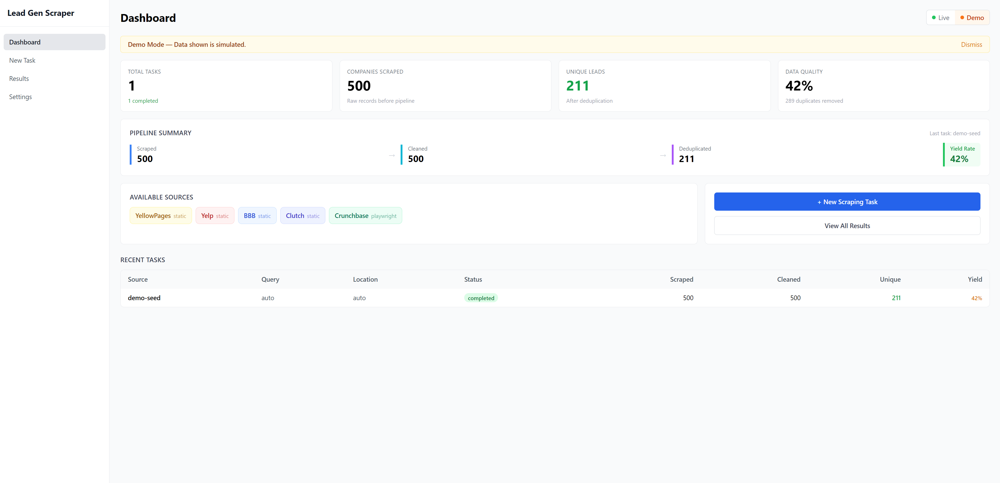
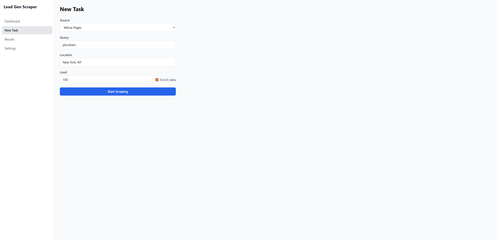
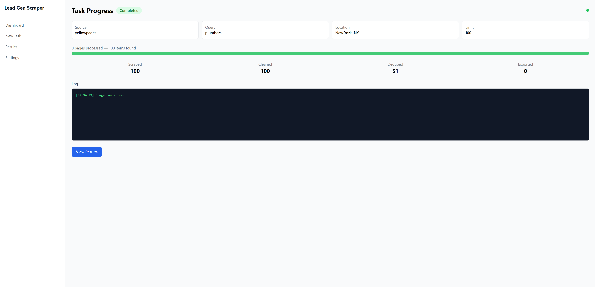
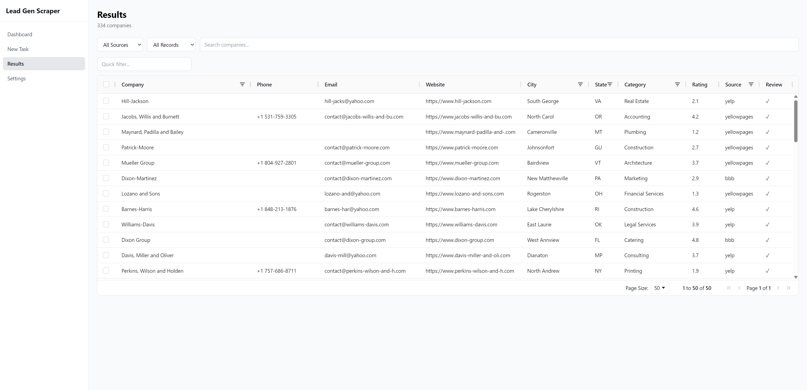
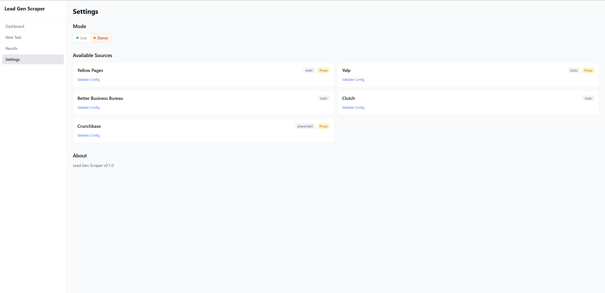

# Lead Gen Scraper

> Config-driven B2B lead generation framework with 4-stage data pipeline. Scrape, clean, validate, deduplicate, and export company contacts from 5+ public directories.

       

## The Problem

B2B sales teams spend 3-5 hours daily on manual lead research — copying company data from directories into spreadsheets. The data is dirty (mixed phone formats, HTML entities, Unicode garbage), full of duplicates across sources, and there's zero visibility into data quality. Adding a new directory means hiring a developer for weeks.

## The Solution

Lead Gen Scraper automates the entire pipeline: configure a source in YAML, run a scrape, and get clean, validated, deduplicated leads exported to CSV, Excel, or Google Sheets. Adding a new source takes 15 minutes — no code changes.

## Features

### Data Collection
- **5 Pre-Built Sources** — YellowPages, Yelp, BBB, Clutch, Crunchbase
- **YAML Config-Driven** — New source = new YAML file, zero code changes
- **Two Scraper Engines** — Static (httpx) for HTML, Dynamic (Playwright) for JS sites
- **Anti-Detection** — Proxy rotation with quarantine, UA rotation, stealth plugin, Gaussian delays

### Data Pipeline
- **Stage 1: HTML & Unicode Cleaner** — Strips HTML entities, zero-width chars, normalizes whitespace
- **Stage 2: Field Validator** — Email regex + MX + SMTP check, phone normalization (+1-XXX-XXX-XXXX), URL validation
- **Stage 3: Deduplicator** — Exact match (phone/email) + fuzzy match (rapidfuzz, 85% threshold)
- **Stage 4: Enricher** — Website health check, email extraction from contact pages
- **Pipeline Stats** — Per-stage counters: scraped -> cleaned -> validated -> deduplicated

### Results & Export
- **AG Grid Results Table** — Filter, sort, search, inline edit, checkbox selection
- **4 Export Formats** — CSV (UTF-8 BOM), Excel (frozen panes, auto-filter), JSON, Google Sheets
- **Real-Time Progress** — WebSocket updates during scraping

### Quality & Testing
- **253 Automated Tests** — 216 backend (pytest) + 37 frontend (vitest)
- **Demo Mode** — 500 intentionally dirty records -> pipeline -> ~228 clean results
- **One-Command Deploy** — `docker-compose up` starts all 5 services with auto-seeded data

## Screenshots

### Dashboard


### New Task


### Task Progress


### Results


### Settings


## Architecture

```
Frontend (React + TypeScript)
    |
    v
Nginx (static files + reverse proxy)
    |
    +---> /api/* ---> FastAPI (17 REST endpoints)
    |                      |
    +---> /ws/*  ---> WebSocket (real-time progress)
                           |
                     Celery Worker ---> Redis (broker + pub/sub)
                           |
                     Source Router
                      /         \
              Static Scraper   Dynamic Scraper
             (httpx + parsel)  (Playwright + stealth)
                      \         /
                    YAML Configs (5 sources)
                           |
                     Data Pipeline
                     Stage 1: HTML/Unicode Cleaner
                     Stage 2: Field Validator
                     Stage 3: Deduplicator (rapidfuzz)
                     Stage 4: Enricher
                           |
                     PostgreSQL 15
                           |
                     Export: CSV / Excel / JSON / Google Sheets
```

## Pipeline Deep-Dive

Every scraping task runs through a 4-stage pipeline. Each stage is a composable class — skip any stage via config.

```
Raw Data (1,200 records)
  |
  v
+-------------------------------------+
| Stage 1: HTML & Unicode Cleaner     |  -50 records (4.2%)
| Strip HTML entities, zero-width     |
| chars, normalize whitespace         |
+-------------------------------------+
  |
  v  1,150 records
  |
+-------------------------------------+
| Stage 2: Field Validator            |  -50 records (4.3%)
| Email regex + MX, phone normalize   |
| to +1-XXX-XXX-XXXX, URL validate   |
+-------------------------------------+
  |
  v  1,100 records
  |
+-------------------------------------+
| Stage 3: Deduplicator               |  -150 records (13.6%)
| Exact: phone + email                |
| Fuzzy: rapidfuzz 85% threshold      |
+-------------------------------------+
  |
  v  950 records
  |
+-------------------------------------+
| Stage 4: Enricher (optional)        |  +metadata
| Website alive check (HEAD request)  |
| Email extraction from contact page  |
+-------------------------------------+
  |
  v
950 clean, unique leads
-> Export: CSV / Excel / JSON / Google Sheets
```

## Source Config Example

Adding a new source takes ~15 minutes. Here's the YellowPages config:

```yaml
name: yellowpages
base_url: https://www.yellowpages.com/search
renderer: static
search_params:
  search_terms: "{query}"
  geo_location_terms: "{location}"
pagination:
  type: url_param
  param: page
  start: 1
  max_pages: 50
listing_selector: "div.result"
selectors:
  company_name: "a.business-name::text"
  phone: "div.phones::text"
  address: "div.adr::text"
  website: "a.track-visit-website::attr(href)"
  category: "div.categories a::text"
rate_limit:
  delay_range: [2, 4]
  concurrent: 1
  max_retries: 3
proxy:
  required: true
  country: US
```

The scraper engine reads this config and handles everything — pagination, extraction, rate limiting, retries. No Python code needed.

## Quick Start

```bash
git clone https://github.com/ew13r5/lead-gen-scraper.git
cd lead-gen-scraper

cp backend/.env.example backend/.env

docker-compose up --build
```

Open `http://localhost:3010`. In Demo mode, 500 sample companies are auto-seeded on startup and processed through the pipeline into ~228 clean results.

### Ports

| Service | Port | URL |
|---------|------|-----|
| Frontend | 3010 | http://localhost:3010 |
| API | 8010 | http://localhost:8010/docs |
| PostgreSQL | 5440 | |
| Redis | 6385 | |

## Configuration

| Variable | Default | Description |
|----------|---------|-------------|
| `DATABASE_URL` | `postgresql+asyncpg://...@leadgen-postgres/leadgen` | PostgreSQL connection |
| `REDIS_URL` | `redis://leadgen-redis:6379/0` | Redis for Celery + pub/sub |
| `APP_MODE` | `demo` | `demo` (Faker data) or `live` (real scraping) |
| `EXPORTS_DIR` | `/app/exports` | Export file storage |
| `SOURCES_DIR` | `/app/sources` | YAML source configs |
| `GOOGLE_SHEETS_CREDENTIALS` | _(empty)_ | Service Account JSON for Sheets export |
| `CORS_ORIGINS` | `["http://localhost:3010"]` | Allowed CORS origins |

### Live Mode Requirements

- US proxy for YellowPages/Crunchbase (file: `proxies.txt`, format: `host:port:user:pass`)
- Set `APP_MODE=live` in `.env`

## API Reference

### Tasks
| Method | Endpoint | Description |
|--------|----------|-------------|
| POST | `/api/v1/tasks/` | Create scraping task |
| GET | `/api/v1/tasks/` | List all tasks with pagination |
| GET | `/api/v1/tasks/{id}` | Get task details and counters |
| DELETE | `/api/v1/tasks/{id}` | Cancel running task |

### Results
| Method | Endpoint | Description |
|--------|----------|-------------|
| GET | `/api/v1/results/` | List companies (filter by source, city, category) |
| GET | `/api/v1/results/{id}` | Get company details |
| PATCH | `/api/v1/results/{id}` | Inline-edit company fields |

### Export
| Method | Endpoint | Description |
|--------|----------|-------------|
| POST | `/api/v1/export/` | Export results (CSV/Excel/JSON/Sheets) |
| GET | `/api/v1/export/{id}/download` | Download exported file |

### Sources & Pipeline
| Method | Endpoint | Description |
|--------|----------|-------------|
| GET | `/api/v1/sources/` | List available YAML sources |
| GET | `/api/v1/pipeline/{task_id}` | Pipeline stage statistics |

### Mode & Demo
| Method | Endpoint | Description |
|--------|----------|-------------|
| GET/PUT | `/api/v1/mode/` | Get/switch mode (live/demo) |
| POST | `/api/v1/demo/seed` | Generate demo data |
| POST | `/api/v1/demo/reset` | Clear demo data |

### System
| Method | Endpoint | Description |
|--------|----------|-------------|
| GET | `/api/v1/health` | PostgreSQL + Redis health check |
| WS | `/ws/tasks/{id}/progress` | Real-time scraping progress |

## Database Schema

| Table | Purpose |
|-------|---------|
| `companies` | Scraped company data (30 fields, UUID PK, indexes on source/city/state) |
| `scrape_tasks` | Task metadata, status tracking, pipeline counters |
| `pipeline_stats` | Per-stage metrics (count_in/out/removed, duration_ms) |
| `export_log` | Export history with file paths and row counts |

## Tech Stack

| Layer | Technology |
|-------|-----------|
| Scraping (static) | httpx + parsel (CSS/XPath) |
| Scraping (dynamic) | Playwright + playwright-stealth |
| Data Pipeline | Custom composable stages |
| Fuzzy Matching | rapidfuzz (token_sort_ratio) |
| Backend | FastAPI + Pydantic v2 |
| Database | PostgreSQL 15 + SQLAlchemy 2.0 (async) + Alembic |
| Task Queue | Celery + Redis |
| Real-time | WebSocket + Redis Pub/Sub |
| Frontend | React 18 + TypeScript + Tailwind CSS |
| Results Table | AG Grid Community |
| Export | openpyxl, gspread, csv, json |
| Testing | pytest (216) + vitest (37) = 253 tests |
| Deploy | Docker Compose (5 services) |

## Testing

```bash
# Backend
cd backend && uv run pytest

# Frontend
cd frontend && npm test

# TypeScript check
cd frontend && npx tsc --noEmit
```

## Development

```bash
# Backend (without Docker)
cd backend
uv sync
uv run uvicorn main:app --reload    # API on :8000

# Frontend
cd frontend
npm install
npm run dev                          # Dev server on :5173
```

## Project Structure

```
lead-gen-scraper/
  backend/
    api/routes/          REST endpoints + WebSocket + pub/sub
    scrapers/            StaticScraper, DynamicScraper, SourceRouter
    pipeline/            HTMLCleaner, FieldValidator, Deduplicator, Enricher
    tasks/               Celery scrape task + processing helper
    sources/             5 YAML source configs
    db_models/           SQLAlchemy ORM models
    demo/                Faker data seeder
    anti_detection/      Proxy rotation, UA rotation, stealth
    alembic/             Database migrations
    tests/               216 tests
  frontend/
    src/components/      10 React components
    src/pages/           5 page views
    src/hooks/           6 custom hooks
    src/api/             Typed Axios client
    tests/               37 tests
  docker-compose.yml     5 services
  README.md
```

## License

MIT
